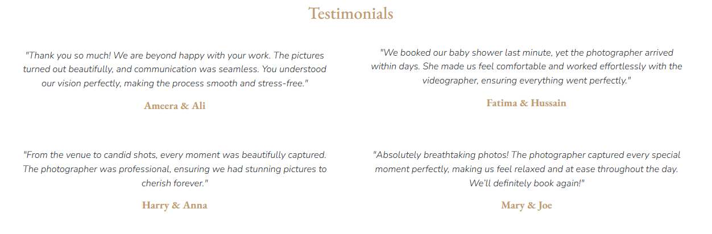
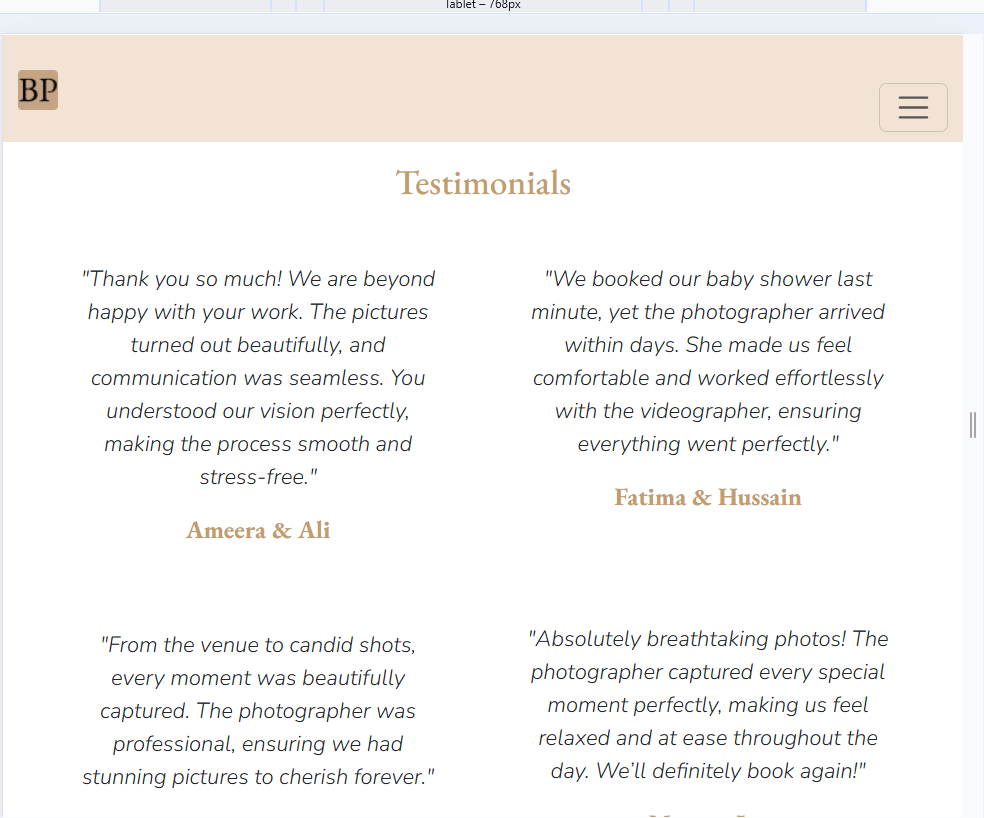
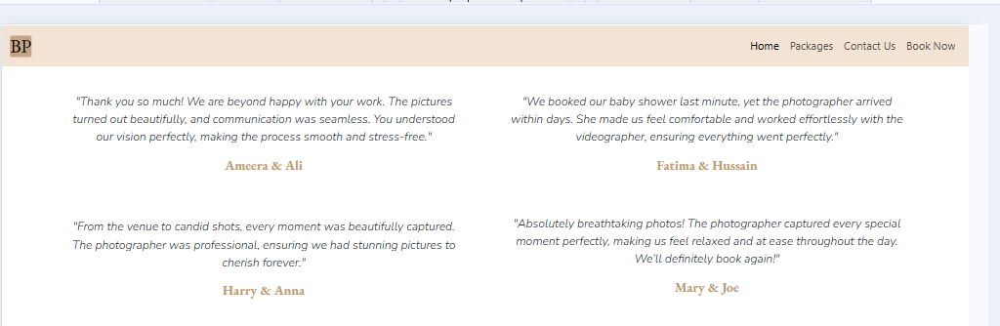
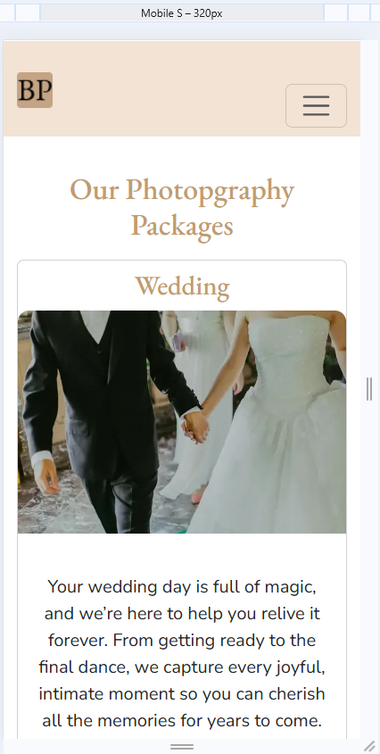
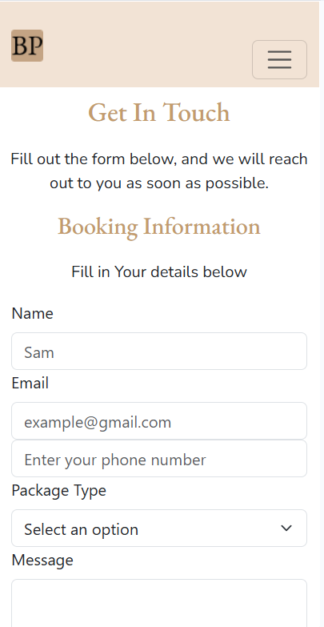

# Best Photography 

Welcome to Best Photography, where we specialize in capturing life's most precious moments. Whether it's a wedding, family portrait, or professional headshot, we are dedicated to providing you with stunning photos that you'll cherish forever. Our website offers a glimpse into our services, including:

- **Free consultations** to discuss your vision.
- **Expert photography**  tailored to your needs. 
- **Personalized planning** to ensure a seamless experience.
- **High-quality image editing** for the perfect final result. 

At Best Photography, we are passionate about preserving your memories through the art of photography, making each moment unforgettable.

A live version of the project can be accessed here: [Best Photographer](https://kulthoom12.github.io/best-photographer/)


## UX

### New User Stories

- As a new user I would like to understand what the website offers so I can decide if it’s right for me.
- As a new user I would like to easily navigate the site so I can find what I’m looking for.
- As a new user I would like to contact the photographer through the website to ask questions.
- As a new user I would like to see examples of the photographer’s work so I know what to expect through images.
- As a new user I would like to book a photography session online without any hassle.
- As a new user I would like to learn about different photography packages so I can choose the best one for me.
- As a new user I want to find social media links so I can follow the photographer’s latest updates.

### Existing Users

- As an existing user I would like to book a session.
- As an existing user I would like to find the contact details to contact the photographer.
- As an existing user I want to see any existing photography packages.
  
### Typography 

**[EB Garamond](https://fonts.google.com/specimen/EB+Garamond)**: This font is elegant and classic. It’s used for headings to give the website a sophisticated and timeless look, perfect for the photography services we offer.

**[Nunito](https://fonts.google.com/specimen/Nunito)**: This font is modern, clean, and easy to read. It’s used for the body text and other sections, making the website feel friendly and approachable for visitors.

These fonts were chosen to create a good balance between elegance and readability, making the website professional and welcoming.


## Wireframes

Wireframes were created on paper for mobile, tablet and laptop screens for the home page, packages page and the book now page.

### Mobile 

<details> <summary> Click to view the Mobile Wireframes</summary>


</details>

### Tablet 
<details> <summary> Click to view the Tablet Wireframes</summary>


</details>

### Desktop 
<details> <summary> Click to view the Desktop Wireframes</summary>

</details>


## Features

### Existing Features

The Best Photography website has several important features to make it easy for visitors to find what they need and have a smooth experience.

The **navbar** and **footer** are **consistent** across all pages, including the index.html, packages.html, booking.html, success.html and 404.html. They also share the same  **beige** background color to maintain readability and consistency.

All pages have a **responsive design**. The layout adjusts to mobile, tablet, and desktop screens, ensuring a seamless experience across all devices.

### **Navbar**
- The website has a **fixed navigation bar** that stays at the top of the page, so you can always access the key pages even as you scroll.  
- The navbar has links to **Home**, **Packages**, **Book Now**, and **Contact**, making it easy to get to different parts of the site.  
- The **logo** in the navbar is clickable and it will always take you back to the homepage.  
- On **smaller screens**, the navbar changes into a **mobile-friendly menu**, so it works well on phones and tablets. 
 


### **Footer**
The footer is at the bottom of every page and gives you easy access to important information:
- **Contact Details**: You can find the phone number and email address to get in touch with the photographer.
- **Social Media Links**: Icons for Instagram, Facebook, and Twitter open in new tabs, so you can stay connected with the photographer’s latest work.
- **Quick Links**: The footer also includes links to **Services**, **Testimonials**, and **Packages**, so you can quickly navigate the site.


### Home Page
#### Introduction Section

The homepage is where you first land and gives an introduction to **Best Photography**:
- **Carousel**: An autoplaying carousel is displayed on the left of the page, showcasing photography images of the photographer’s work. 
- **Introduction**: A brief overview of the services provided, including wedding albums, family portraits, and professional headshots. A **button** is displayed on the right of the page introducing 'Best Photographer' to users, and the button enables users to book a photoshoot by directing them to the **booking.html** page.


#### **Service Section**
The **Service Section** on the homepage introduces the main services offered by **Best Photography**. It shows four cards, each explaining a different service.


#### **Testimonials Section**
On the homepage, there is a **Testimonials Section** featuring four reviews from past clients, sharing their experiences with the photographer.



#### **Video Section**
There’s also a **Video Section** on the homepage:
- **Embedded YouTube Video**: A video embedded from YouTube that plays automatically (muted) to engage visitors.


### **Packages Page**
The **Packages Page** provides detailed information on **10 different photography packages**:
- Each package has its own **image, description** and a **Book Now button** with the respective price, making it easy for users to take action.


### **Book Now Page**
The **Booking Form** allows users to book a photography session. It includes the following input fields:
- Name, Email Address, Phone Number, Package Type, Message and a Submit Button.

All input fields are required, and the form cannot be submitted unless all fields are filled out.


### **404 Error Page**
If a user tries to go to a page that doesn't exist, they’ll be directed to a **404 Error Page**:
- This displays a message that informs the user that the page they are looking for doesn’t exist.
- There’s a **button** that says "Go back to home," so users can easily go back to the homepage.


### **Booking Success Page**
Once a user successfully books a session, they’ll be taken to a **Thank You Page**:
- A message pops up saying, "Thank you for your booking!"
- It lets the user know that the photographer will get in touch soon.
- There’s also a **button** that says "Go back to home," which takes them back to the homepage.


### Future Features

### Newsletter Subscription
- A newsletter signup option where users can receive updates on promotions, new photography packages, and blog posts.  
- Users can sign in to view their past bookings and they can book future bookings too.

## Deployment

### GitHub Pages

To deploy the website, follow these steps:

1. Log in to [GitHub](https://github.com/).
2. Go to the repository: **[kulthoom12/best-photographer](https://github.com/kulthoom12/best-photographer)**.
3. Click on the **Settings** tab.
4. Click the **Code and automation** section and then click **Pages**.
5. Under **Build and deployment**, select the **main** branch.
6. Click **Save**.

The **Best Photography** website is hosted on GitHub Pages. You can view the live website by clicking [here](https://kulthoom12.github.io/best-photographer/).

### Forking the GitHub Repository

To create a copy of the repository in your own GitHub account:

1. Log in to [GitHub](https://github.com/).
2. Search for **[best-photographer](https://github.com/kulthoom12/best-photographer)** repository.
3. Click on the **Fork** button at the top-right corner and click select **Create a new fork**.
4. Now, the repository will be copied to your GitHub account, and you can make changes without affecting the original one.

### Making a Local Clone

To download the project to your computer:

1. Log in to [GitHub](https://github.com/).
2. Go to **[best-photographer](https://github.com/kulthoom12/best-photographer)**.
3. Click on the **Code** button and select **Clone**.
4. Copy the repository URL.
5. Open your terminal or Git Bash in your preferred code editor.
6. Type this command and hit Enter:
   ```bash
   git clone https://github.com/kulthoom12/best-photographer.git

## Testing 

### HTML Testing

<details> <summary> Click to view the HTML testing </summary>


| Page     | Screenshot Before                                              | Screenshot After                                              |
| -------- | -------------------------------------------------------------- | ------------------------------------------------------------- |
| Home     |     |     |
| Packages |  |  |
| Booking  |   |   |
| Error    |     |     |
| Success  |          |         |

</details>


### CSS Testing

<details> <summary> Click to view the CSS testing </summary>

| Page | Screenshot Before                                  | Screenshot After                                   |
| ---- | -------------------------------------------------- | -------------------------------------------------- |
| Home |  |  |

</details>

### Responsiveness

<details> <summary> Click to view the CSS testing </summary>

| Device              | Mobile                                                                          | Tablet                                                                          | Laptop                                                                          |
| ------------------- | ------------------------------------------------------------------------------- | ------------------------------------------------------------------------------- | ------------------------------------------------------------------------------- |
| Home Carousel/About |               |               |               |
| Home Services       |       |               |               |
| Home Contact        |              |       |       |
| Home Testimonials   |  |  |  |
| Packages            |           |           |           |
| Book Now            |            |            |            |

</details>

### Lighthouse Audit

<details> <summary> Click to view the Lighthouse Inspection</summary>

| Page     | Device  | Screenshot Before                                                    | Lighthouse advice                                                              | Screenshot After                                                     |
| -------- | ------- | -------------------------------------------------------------------- | ------------------------------------------------------------------------------ | -------------------------------------------------------------------- |
| Home     | Mobile  |       |       |       |
| Home     | Desktop |      |      |      |
| Packages | Mobile  |   |   |   |
| Packages | Desktop |  |  |  |
| Booking  | Mobile  |    |    |    |
| Booking  | Desktop |   |   |   |

</details>

### Browser Compatibility

### Bugs

## Tools and Technologies Used

## Credits

### Content

### Media

### Acknowledgements
